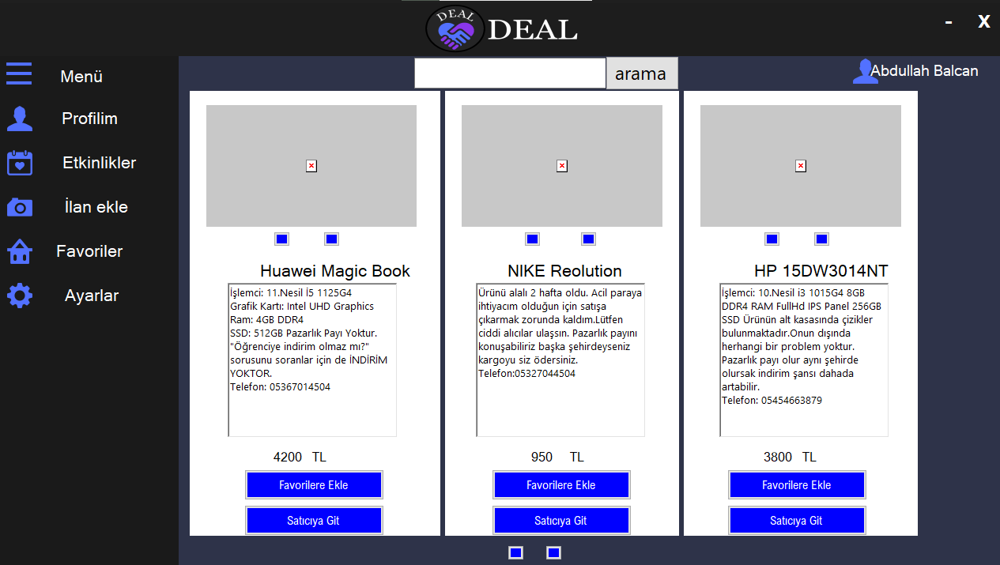

# C# ile Alışveriş Form Uygulaması

 
 
 ## Projenin Amacı ve Özelliği
 Veri tabanı (SQL) ve C# ile form uygulamlarını kullanarak temel düzey bir ürün satın alma sitesinin yapılması 
  
 <ul>
 <li>Login Sayfası (Yeni Üye Kayıt,Giriş Yap)</li>
 <li>Veritabanına üye kayıt,üye sorgulama işlemleri</li>
 <li>Kullanıcıya ait favori ve sepet listesi</li>
  <li>Toplam Hesap Sayfası</li>

 </ul>

